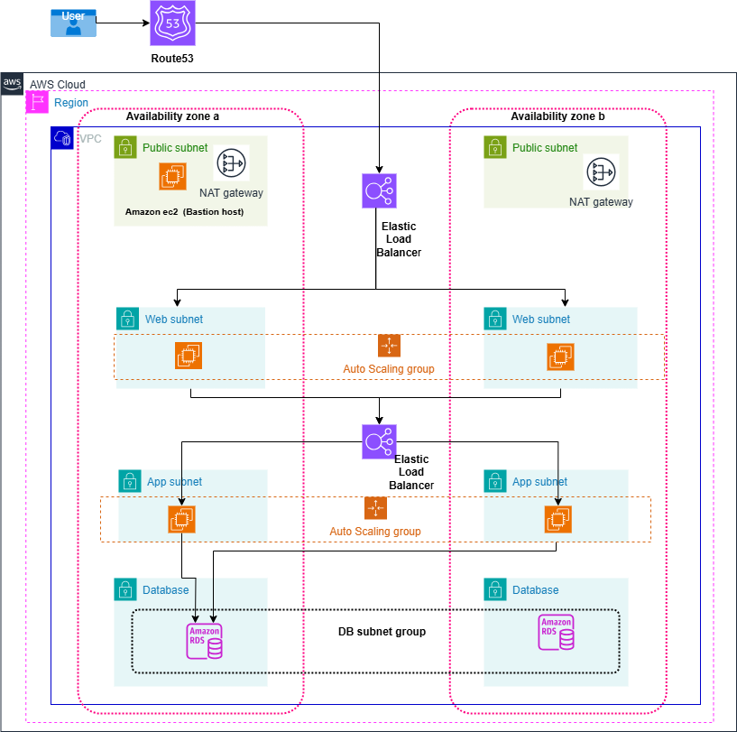

# 3tier_architecture_terraform


# Workflow Overview

# 1. User Request: A user sends a request, which is routed through Route 53.
# 2. Load Balancing: The ELB distributes the request to an available web server in the web subnet.
# 3. Web Server Processing: The web server processes the request or forwards it to the app server.
# 4. App Server Logic: The app server performs business logic, querying the Amazon RDS database if needed.
# 5. Response Delivery: The data flows back from the app server to the web server, through route53, and then to the user.

# Three-Tier Architecture Terraform Project

## Overview

This project provisions a highly available, scalable, and fault-tolerant Three-Tier Architecture on AWS using Terraform.

The infrastructure is designed across multiple Availability Zones and supports Disaster Recovery (DR) in a secondary AWS region.


# Architecture

The project follows a standard Three-Tier Architecture:

### 1. Presentation Layer

* CloudFront
* Route 53
* Application Load Balancer (Frontend)
* Frontend EC2 instances

### 2. Application Layer

* Internal/Application Load Balancer
* Backend EC2 instances
* Auto Scaling Groups

### 3. Database Layer

* Amazon RDS MySQL
* Multi-AZ Deployment

---

# AWS Services Used

* Amazon VPC
* EC2
* Auto Scaling Group
* Launch Templates
* Application Load Balancer (ALB)
* Route 53
* CloudFront
* AWS Certificate Manager (ACM)
* Amazon RDS
* NAT Gateway
* Internet Gateway
* AWS Backup
* IAM
* Security Groups

---

# Features

* Infrastructure as Code using Terraform
* Modular Terraform Structure
* Multi-AZ Deployment
* High Availability
* CloudFront CDN
* Auto Scaling
* Secure Private Subnets
* Bastion Host Access
* RDS Multi-AZ with Read Replica
* SSL Certificates using ACM

---

# Infrastructure Workflow

## (us-east-1)

### Networking

* Create VPC
* Create Public and Private Subnets
* Configure Route Tables
* Attach Internet Gateway
* Create NAT Gateway

### Security

* Configure Security Groups
* Restrict access between tiers

### Database

* Create RDS MySQL Multi-AZ
* Create Private Hosted Zone
* Configure DB DNS Record

### Compute

* Create Frontend and Backend AMIs
* Create Launch Templates
* Create Auto Scaling Groups

### Load Balancing

* Create Frontend ALB
* Create Backend ALB
* Configure HTTPS Listener

### DNS & CDN

* Configure Route53 Failover
* Configure CloudFront Distribution
* Configure ACM Certificates
---

# Prerequisites

Before deploying this project, ensure you have:

* AWS Account
* Terraform Installed
* AWS CLI Configured
* IAM User with Required Permissions
* Domain Name for Route53

---

# Deployment Steps

## 1. Clone Repository

```bash
git clone https://github.com/jadalaramani/3tier_architecture_terraform.git

cd 3tier_architecture_terraform
```

---

## 2. Initialize Terraform

```bash
terraform init
```

---

## 3. Validate Configuration

```bash
terraform validate
```

---

## 4. Review Execution Plan

```bash
terraform plan
```

---

## 5. Deploy Infrastructure

```bash
terraform apply -auto-approve
```

---

# Terraform Modules

## VPC Module

Creates:

* VPC
* Public/Private Subnets
* Route Tables
* Internet Gateway
* NAT Gateway

---

## Security Group Module

Creates:

* ALB Security Groups
* Frontend SG
* Backend SG
* RDS SG
* Bastion SG

---

## EC2 Module

Creates:

* Frontend Instances
* Backend Instances
* Bastion Host

---

## Auto Scaling Module

Creates:

* Frontend ASG
* Backend ASG
* Scaling Policies

---

## ALB Module

Creates:

* Frontend ALB
* Backend ALB
* Target Groups
* HTTPS Listeners

---

## RDS Module

Creates:

* RDS MySQL
* Multi-AZ Database
* Read Replica

---

## Route53 Module

Creates:

* Public Hosted Zone
* Private Hosted Zone

---


# Security Best Practices

* EC2 instances deployed in private subnets
* RDS not publicly accessible
* Bastion Host for SSH access
* HTTPS enabled using ACM
* Security Group-based access control
* Private Hosted Zones for internal DNS

---

# Auto Scaling Configuration

Frontend and backend servers automatically scale based on:

* CPU Utilization
* Network Traffic
* Health Checks

---

# Accessing the Application

## Frontend

```bash
https://threetier.<your-domain>.xyz
```

## Backend API

```bash
https://api.<your-domain>.xyz
```

---

# Cleanup Resources

To destroy infrastructure:

```bash
terraform destroy -auto-approve
```

---


# Reference Architecture

This project is based on enterprise-grade AWS Three-Tier Architecture principles with:

* High Availability
* Scalability
* Security
* Disaster Recovery

---
## Manual Steps Required After Terraform Deployment

Some configurations are completed manually after the Terraform infrastructure deployment.

---

# Manual Configuration Steps

## 1. Create Public Hosted Zone in Route 53

* Open AWS Route 53
* Navigate to Hosted Zones
* Click **Create Hosted Zone**
* Enter domain name:

```bash 
b17facebook.xyz
```

* Select:

  * **Public Hosted Zone**
* Click **Create Hosted Zone**

### Update Nameservers

* Copy NS records from Route53
* Update them in your domain registrar (GoDaddy/etc.)

---

## 2. Create ACM Certificates 

Certificates must be created manually because ACM certificates are region-specific.


### Steps

* Open AWS Certificate Manager (ACM)
* Click **Request Certificate**
* Select:

  * Public Certificate

Add domain:

```bash 
*.b17facebook.xyz
```

Validation method:

* DNS Validation

Create certificate.

### Validate Certificate

* Create CNAME records in Route53
* Wait until status becomes:

---

## 3. Add HTTPS Listeners in Frontend & Backend ALBs

Terraform creates ALBs, but HTTPS listeners and ACM certificate attachment are configured manually.

---

## Frontend ALB Listener

### Steps

* Open EC2 Console
* Go to Load Balancers
* Select Frontend ALB
* Click **Listeners**
* Click **Add Listener**

Configuration:

```bash id="u2d5fx"
Protocol : HTTPS
Port     : 443
Target   : frontend-target-group
Certificate : ACM Certificate
```

Save Listener.

---

## Backend ALB Listener

### Steps

* Select Backend ALB
* Click **Add Listener**

Configuration:

```bash id="6mn94d"
Protocol : HTTPS
Port     : 443
Target   : backend-target-group
Certificate : ACM Certificate
```

Save Listener.

---

## 4. Create API Record in Route53

Create API DNS record pointing to Backend ALB.

### Record Details

```bash id="t2z5jq"
Record Name : api
Domain      : api.b17facebook.xyz
Type         : A Record
Alias        : Yes
Target       : Backend ALB DNS
```

### Final Endpoint

```bash id="4jsd0x"
https://api.b17facebook.xyz
```

This record routes frontend API requests to backend ALB.

---

## Add the record of rds in private hosted zone rds.com

```
book.rds.com ---> database endpoint as a record
```


## 5. Connect Backend Server from Bastion Host

Since backend servers are in private subnets, connect through Bastion Host.

---

## Step 1: Connect to Bastion Host

```bash id="w5i8jw"
ssh -i key.pem ubuntu@<BASTION_PUBLIC_IP>
```

---

## Step 2: Copy PEM File

Inside Bastion Host:

```bash id="b0rb02"
vim key.pem
```

Paste key contents.

Give permissions:

```bash id="0c7w0i"
chmod 400 key.pem
```

---

## Step 3: Connect Backend Server

```bash id="mpq18m"
ssh -i key.pem ubuntu@<BACKEND_PRIVATE_IP>
```

---

## Step 4: Navigate to Backend Directory

```bash id="n9w5pb"
cd /home/ubuntu/aws_three_tier_code/backend
```

---

## Step 5: Install Node Packages

```bash id="w7k1mv"
npm install
npm install dotenv
npm install mysql2
sudo pm2 start index.js --name "backendapi"
sudo pm2 logs backendapi
sudo apt install mysql-server -y
```
## Step 8: Initialize Database

```bash id="u1y9gj"
mysql -h book.rds.com -u admin -p<password> test < test.sql
```

---


# Final Application URLs

## Frontend

```bash id="1m8g4k"
https://threetier.b17facebook.xyz
```

## Backend API

```bash id="9h5ah4"
https://api.b17facebook.xyz
```


